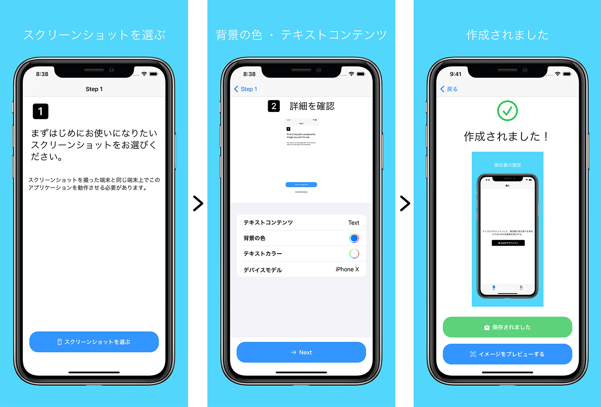

# ScreenshotMake

テキストと端末のフレーム画像を使ってスクリーンショット画像を生成するのに役立つアプリをApp Storeで公開しました。

[App Storeのページはこちら](https://apps.apple.com/jp/app/id1528859331)

このアプリケーションのコードはオープンソース化することにしましたので、シミュレータ上で直接コードを実行し、生成された画像をエクスポートしていただけます。

著作権上の理由により、アイコンのファイルが削除されました。

このプロジェクトは、私が１～２日で完成させたものです。コードの構成には改善の余地がありますが、最適化に時間を費やすよりも、すぐに公開することを選びました（開発者の方々がこのアプリを使用できるように）。

## 使い方

1. このリポジトリをローカルマシンにクローンします
2. このアプリをシミュレーターにインストールします
3. アプリをテストし、`command-S` を押してアプリのスクリーンショットを撮ることができるようになりました。スクリーンショットをデバイスにコピーするには、生成されたスクリーンショットをシミュレーターデバイスのウインドウにドラッグすると良いでしょう。
4. `ScreenshotMake`アプリをシミュレーターで開けるようになりました。
5. `ScreenshotMake`アプリを使ってスクリーンショットを生成し、シミュレーターのアルバムに保存できます。
6. シミュレーターのUUIDを確認するには、ターミナルで `xcrun simctl list` コマンドを実行します。
7. 生成された画像は `/Users/[Your system username]/Library/Developer/CoreSimulator/Devices/[Device UUID]/data/Media/DCIM/100APPLE/` にあります。写真をシミュレーターからコンピューターにコピーし、その画像をApp Storeにアップロードできます。

## Contribution

I would be happy if you want to contribute to this repository. Please create Github issues or pull requests. こちらでは投稿を歓迎しています！お気軽にイシューやプルリクエストを開始してください。

## App Store説明文

スクリーンショットを撮り、そのスクリーンショットにテキストやきれいなフレームを追加したい。このアプリケーションを使えばそれが可能になります！

1. スクリーンショットを選ぶ
2. 背景の色 ・ テキストコンテンツ（フォントを選択して、フォントサイズを入力できるようになりました）
3. 作成されました

サポートされている端末は iPhone 8 Plus, iPhone X, iPhone XS, iPhone XS Max, iPad Pro のみです。縦向きのスクリーンショットのみサポートされています。また、スクリーンショットを撮影した端末と同じ端末上でこのアプリケーションを起動する必要があります。

お使いの端末（iPhoneなど）でスクリーンショットを撮り、このアプリケーションを起動し、（フレームとテキストで）きれいなスクリーンショット画像に仕上げましょう。

## ライセンス

GNU GPLv3ライセンスに加えて：このリポジトリに含まれているデバイスフレーム画像（およびその他すべての画像）はテンプレート画像として使用することを目的としています。これらの画像を再配布することは禁止されています。本コードまたは本コードの修正版をApp Storeに公開することはできません。

In addition to the GNU GPLv3 license: The device frame images (and all other images) contained in this repository are intended for use as template images. Redistributing these images is prohibited. This code or a modified version of this code may not be published on the App Store.

---

:relaxed: [Twitter @MaShunzhe](https://twitter.com/MaShunzhe)

:page_facing_up: [私の公開されているiOSの記事のリストをカテゴリー別にご覧いただけます (45)](https://mszmagic.com/ioskiji/)

:sparkles: 私が公開したすべてのQiitaプログラミング記事を読むのに使えるApp Clipを作成しました。お持ちのiPhoneからこのコードをスキャンして閲覧できます。

